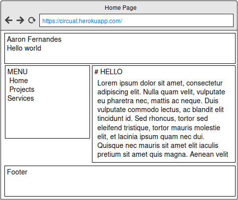

EXTERNAL DOCUMENT - ASSIGNMENT 1
====

# Wireframe 
This is a basic Wireframe used the assignment

# Technologies Used

## Backend Technologies:

### [Express.js](http://expressjs.com/):
A web application framework for Node.js. All API (routes) are generated using this framework.

### [EJS](https://www.npmjs.com/package/ejs)
Embedded JavaScript templates

### [Body Parser](https://www.npmjs.com/package/body-parser)
Used to parse POST requests to the `/contact` endpoint

## Frontend Technologies: 
